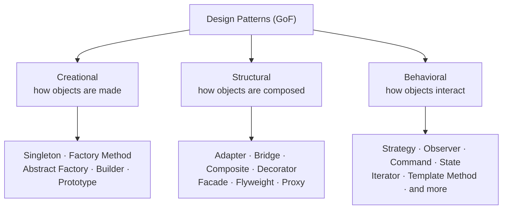

> **In one line.** A design pattern is a *named, proven solution to a problem that keeps coming up* — a shared vocabulary that lets one engineer say "let's use a Strategy here" and another instantly know what they mean.

Patterns aren't code you download. They're **descriptions of a design** that you adapt to your language and problem. The catalog comes from the 1994 book *Design Patterns* by the "Gang of Four" (GoF), which cataloged 23 of them. That catalog is the backbone of this guide — but we read it through a **Go lens**, because Go changes the answers.

## Why patterns are worth your time

  

🗣️
<h3>Shared vocabulary</h3>
"Wrap it in a Decorator" compresses a paragraph of explanation into two words on a code review.

  

🧩
<h3>Tried-and-tested</h3>
Each pattern encodes trade-offs people already learned the hard way, so you skip some of the mistakes.

  

🔌
<h3>Design for change</h3>
Most patterns exist to isolate the part of a system most likely to change behind a stable interface.

## The three families

The 23 GoF patterns split into three groups by *what kind of problem* they solve.

🎯 A quick way to remember them

**Creational** = the *birth* of objects. **Structural** = the *shape* objects form together. **Behavioral** = the *conversation* between objects.

## Why Go is different

Most pattern tutorials are written for Java or C++. Go deliberately omits features those languages lean on — and that changes everything.

| Java / C++ relies on… | Go gives you instead… | Effect on patterns |
|---|---|---|
| Class inheritance | **Struct embedding** (composition) | Template Method, Decorator become composition |
| Explicit `implements` | **Implicit, small interfaces** | Adapter & Strategy get trivial |
| Objects everywhere | **First-class functions** | Strategy/Command can be a `func` value |
| Threads + locks | **Goroutines + channels** | Observer/Pub-Sub become channel-native |
| Constructors | **Plain `NewX()` functions** | Factory Method is just a function |

🐹 The Go proverbs that matter here

"**Accept interfaces, return structs.**" · "**The bigger the interface, the weaker the abstraction.**" · "**Don't communicate by sharing memory; share memory by communicating.**" Each one quietly rewrites a classic pattern.

So in this guide, every pattern page asks two questions: *what's the classic shape?* and *what does it actually look like in idiomatic Go?* Sometimes the answer is "a one-line function." That's a feature, not a disappointment.

## The four pillars behind Go's approach

- **Interfaces are implicit.** A type satisfies an interface just by having the methods — no `implements` keyword. This makes Adapter, Strategy and Dependency Injection nearly free.
- **Embedding, not inheritance.** Put a struct inside another and its methods are promoted. You get reuse without a class hierarchy.
- **Functions are values.** You can pass behavior directly, so many "make an object to hold one method" patterns collapse.
- **Concurrency is built in.** Goroutines and channels turn Observer, Pipeline and Pub/Sub into language-level idioms.

## How to read a pattern page

Every pattern in this guide follows the same structure, so you always know where to look:

  

①
<h3>Intent & analogy</h3>
One-line purpose plus a real-world story to anchor it in memory.

  

②
<h3>Problem & structure</h3>
The pain it removes, then a UML diagram of the moving parts.

  

③
<h3>Idiomatic Go</h3>
Runnable Go code — the Go-native form, not a Java translation.

  

④
<h3>Trade-offs & quiz</h3>
When to use it, when not to, where the stdlib uses it, and a self-check.

✅ Mark pages as 'learned'

Use the **Mark as learned** button on every pattern page to track your journey. Your progress bars on the home page fill up as you go — it's all saved in your browser.

Ready? The most natural place to begin is the very first creational pattern.
