How to implement scalable audit trails without compromising database performance

**Let's fix a common anti-pattern:** Storing audit logs in your production database. It *seems* easy—until it tanks performance and bloats storage.

I learned this lesson the hard way. A colleague once insisted on implementing audit logs directly in our main DB, dismissing my concerns. Days later, it was done. I warned him of the impending database doom. Months passed, and then the inevitable: a frantic message about our database ballooning by a staggering 600MB per minute, causing critical issues that demanded immediate action.

## 🚨 The Hidden Costs


### Real-world impact:
- **40% slower writes** during peak hours
- **3x storage growth** in 6 months
- **Compliance reports timing out**
- **Lock contention** causing transaction delays

## ✨ The Solution: Structured Logging & Decoupled Architecture

The path to a robust, scalable, and cost-effective audit logging strategy involves two key pillars:

### 1. Structured Logging

Move beyond plain text! Format your logs as machine-readable key-value pairs, ideally JSON. This transforms logs into actionable data, enabling:

- **Enhanced Searchability & Filtering:** Quickly find specific events by user_id, event_type, error_code, etc.
- **Automated Analysis:** Seamless integration with log management and SIEM tools
- **Improved Debugging:** Rich context helps pinpoint root causes faster
- **Consistency & Scalability:** Standardized formats across distributed systems

**Best Practice:** Always use UTC and ISO 8601 for timestamps (e.g., 2025-01-08T14:30:00Z). **Never log sensitive data** like passwords or Personally Identifiable Information (PII).

```go
// Go: JSON-structured log example
type AuditEvent struct {
    Timestamp string `json:"timestamp"` // ISO 8601 UTC
    UserID    string `json:"user_id"` 
    Action    string `json:"action"`   // "login", "delete"
    Entity    string `json:"entity"`   // "order", "user"
}
```

**Why this works:**
- Enables filtering by `user_id`, `action`, etc.
- Integrates seamlessly with Security Information and Event Management (SIEM) tools

### 2. Decoupled Cloud Storage & Reporting

Offload audit logs to purpose-built cloud services. This ensures your main application database remains performant and allows for specialized tools for analysis and reporting.

#### **Cloud Alternatives for Audit Logs:**

**Google Cloud Platform (GCP):**
- **Cloud Logging:** Fully managed service for log storage, search, analysis, monitoring, and alerting
- **BigQuery:** For complex analytical SQL queries on large log datasets
- **Cloud Storage:** Cost-effective for long-term archival

**Amazon Web Services (AWS):**
- **CloudTrail:** Records AWS API calls for governance and compliance
- **CloudWatch Logs:** Centralizes logs from applications and AWS services
- **Amazon S3:** Highly scalable object storage for long-term archival
- **Amazon OpenSearch Service:** For powerful log analysis and visualization

## 📊 Empowering Business Admins: Reporting & Querying

Audit logs aren't just for tech teams; they're a goldmine for business intelligence! Build a separate reporting layer, ideally a data warehouse or data mart, optimized for analytical queries. This empowers back-office teams with:

- **Intuitive Search & Query:** Easy access to specific user actions, transactions, or compliance data
- **Data Visualization:** Dashboards, charts, and trendlines for quick insights
- **Automated Alerting:** Proactive notifications for security violations or business rule breaches
- **Compliance Verification:** Streamlined generation of audit trails for regulatory needs

**Tools:** ELK Stack (Elasticsearch, Logstash, Kibana), cloud-native services (GCP Cloud Logging Analytics, AWS CloudWatch Logs), and specialized audit management software.

## 🚀 GCP Cloud Logging with GoLang Example

Here's how you can create and query structured audit logs using Go with GCP Cloud Logging:

### Log to Cloud Logging:
```go
func logAudit(event AuditEvent) error {
    entry := logging.Entry{
        Payload:   event,
        Severity: logging.Info,
        Timestamp: time.Now().UTC(),
        Labels: map[string]string{
            "service": "audit-service",
            "version": "v1.0",
        },
    }
    
    return logger.Log(entry)
}
```

### Query in BigQuery:
```sql
-- Daily active users report
SELECT
  COUNT(DISTINCT user_id) AS active_users,
  DATE(timestamp) AS day
FROM `project.audit.logs`
GROUP BY day
```

## 🏗️ Our Awesome Audit Trail Blueprint!

```mermaid
graph TD
%% Application Layer
   A[Your App/Service ✍️] -- "Generates structured logs (JSON)" --> Z[Log Shippers/Collectors 🚀<br/>Fluentd / Logstash / Vector<br/>Filebeat / Fluent Bit]

%% Ingestion Layer
Z -- "Forwards to managed services" --> B[Log Ingestion Services ☁️<br/>Cloud Logging / CloudWatch Logs<br/>Azure Monitor / Datadog]

%% Processing & Routing Hub
B -- "Routes & processes logs 📬" --> C{Log Processing Engine 🔄<br/>Pub/Sub / Kinesis / Kafka<br/>Event Hubs}

%% Storage Paths
C -- "Archive for compliance 📦" --> D[Cold Storage Archive 🧊<br/>S3 Glacier / Cloud Storage Coldline<br/>Azure Cool Storage]

C -- "Real-time indexing 🔍" --> E[Search & Analytics Engine ⚡<br/>Elasticsearch / OpenSearch<br/>Splunk / Datadog]

C -- "Batch processing 💾" --> F[Hot Storage 🔥<br/>S3 Standard / GCS Standard<br/>For ETL processing]

%% Analytics Layer
F -- "ETL pipeline" --> G[Data Warehouse 🧠<br/>BigQuery / Snowflake<br/>ClickHouse / Redshift]

%% Visualization Layer
E -- "Real-time monitoring 📊" --> H[Operational Dashboards ⚡<br/>Kibana / Grafana<br/>Splunk Dashboards]

G -- "Business intelligence 📈" --> I[BI & Reporting Tools 💡<br/>Tableau / Power BI<br/>Looker / Custom Reports]

%% User Groups
H -- "Alerts & monitoring 🚨" --> J[Operations Teams 🛡️<br/>DevOps / SRE / Security<br/>Platform Engineering]

I -- "Business insights 💼" --> K[Business Stakeholders 📊<br/>Analysts / Management<br/>Product Teams]

%% Application Data Flow
A -- "Transactional operations 🏃‍♂️" --> L[Application Database 💾<br/>PostgreSQL / MySQL<br/>MongoDB / DynamoDB]

%% Database Logs Integration
L -.-> |"DB logs & metrics (separate flow)"| B

%% Backup & Disaster Recovery
F -.-> |"Disaster recovery backup"| D

%% Real-time Streaming Path
C -- "Stream processing" --> M[Real-time Processing 🌊<br/>Dataflow / Kinesis Analytics<br/>Apache Flink / Spark Streaming]

M --> E
```



**In short:** We're giving your audit logs their own awesome pipeline so they can be super useful without making your main app slow and grumpy! 😎

### Architecture Components

#### 🎯 **Application Layer**
**Your App/Service ✍️** - The source of all logs, producing structured events with contextual information while avoiding sensitive data.

#### 🚀 **Collection Layer**
**Log Shippers/Collectors** - Lightweight agents that ensure reliable log forwarding:
- **Fluentd**: Ruby-based, plugin-rich
- **Vector**: Rust-based, high-performance
- **Filebeat**: Lightweight, Elastic-focused
- **Fluent Bit**: Ultra-lightweight, container optimized

#### ☁️ **Ingestion Layer**
**Log Ingestion Services** - Managed cloud services for scalable log reception:
- **Cloud Logging (GCP)**: Automatic scaling with retention policies
- **CloudWatch Logs (AWS)**: Integrated AWS ecosystem
- **Azure Monitor**: Built-in analytics platform
- **Datadog**: Third-party SaaS with advanced features

#### 🔄 **Processing Layer**
**Log Processing Engine** - Routes, transforms, and distributes logs:
- **Pub/Sub (GCP)**: Serverless messaging
- **Kinesis (AWS)**: Real-time data streaming
- **Kafka**: Industry standard for high-throughput
- **Event Hubs (Azure)**: Managed event streaming

Core functions include routing, filtering, enrichment, and format conversion.

#### 📦 **Storage Layer**

**Hot Storage 🔥** - Active storage for recent logs (0-90 days):
- **S3 Standard (AWS)**
- **GCS Standard (GCP)**
- **Azure Blob Hot**

**Cold Storage 🧊** - Long-term archival for compliance (1+ years):
- **S3 Glacier (AWS)**
- **Cloud Storage Coldline (GCP)**
- **Azure Cool Storage**

#### 🔍 **Search & Analytics Layer**

**Search & Analytics Engine** - Real-time search and analysis:
- **Elasticsearch**: Full-text search with aggregations
- **OpenSearch**: Open-source with AWS backing
- **Splunk**: Enterprise security analytics
- **Datadog**: SaaS with built-in dashboards

**Real-time Processing 🌊** - Stream processing for immediate analysis:
- **Dataflow (GCP)**: Serverless processing
- **Kinesis Analytics (AWS)**: Real-time analytics
- **Apache Flink**: Low-latency stream processing
- **Spark Streaming**: Micro-batch processing

#### 🧠 **Analytics Layer**
**Data Warehouse** - Complex analytical queries and BI:
- **BigQuery (GCP)**: Serverless with ML integration
- **Snowflake**: Multi-cloud scaling
- **ClickHouse**: Column-store optimization
- **Redshift (AWS)**: Managed with AWS integration

#### 📊 **Visualization Layer**

**Operational Dashboards ⚡** - Real-time monitoring:
- **Kibana**: Elasticsearch visualization
- **Grafana**: Multi-datasource dashboards
- **Splunk Dashboards**: Built-in visualization

**BI & Reporting Tools 💡** - Business intelligence:
- **Tableau**: Advanced drag-and-drop visualization
- **Power BI**: Microsoft's integrated platform
- **Looker**: Modern BI with version control
- **Custom Reports**: Tailored business solutions

## 📊 Essential Audit Log Metrics

### Operational Metrics:
- Log ingestion rate and volume
- Query response times
- Storage costs by service/team
- Failed log deliveries

### Business Metrics:
- User activity trends
- Security event frequency
- Compliance report generation time
- Most queried audit events

### Alerting Examples:
- Spike in failed login attempts
- Unusual admin activity patterns
- Log ingestion failures
- Storage quota approaching limits

## 💰 Cost Optimization Tips

### Storage Tiering Strategy:
- **Hot (0-30 days)**: Standard storage for active investigation
- **Warm (31-365 days)**: Infrequent access storage
- **Cold (1+ years)**: Archive storage for compliance

### Log Sampling:
- Sample non-critical events (e.g., keep 1 in 100 debug logs)
- Always preserve security and error events
- Use intelligent sampling based on user importance

## 🚨 Common Audit Logging Mistakes to Avoid

1. **Logging Sensitive Data**: Never log passwords, credit card numbers, or PII
2. **Synchronous Logging**: Always use async logging to avoid blocking operations
3. **Missing Correlation IDs**: Without request IDs, debugging becomes a nightmare
4. **Inadequate Retention Policies**: Define clear retention based on compliance requirements
5. **No Sampling Strategy**: High-volume services need log sampling to control costs

## ⚡ Performance Best Practices

### Application Side:
- Use buffered/batched logging to reduce I/O
- Implement circuit breakers for logging failures
- Never let logging failures break main application flow

### Infrastructure Side:
- Partition logs by date/service for faster queries
- Use appropriate indexing strategies in search engines
- Implement log rotation and compression

## 🔒 Security & Compliance Considerations

### Data Privacy:
- Implement field-level encryption for sensitive audit data
- Use tokenization or hashing for PII references
- Ensure GDPR/CCPA compliance with data deletion capabilities

### Access Control:
- Restrict audit log access to authorized personnel only
- Implement role-based access (read-only for analysts, full access for security team)
- Audit the auditors - track who accesses audit logs

### Integrity Assurance:
- Use immutable storage for critical audit trails
- Implement log signing or blockchain for tamper-evidence
- Regular integrity checks and alerting

## 🧩 Key Takeaways

1. **Never log to production DB** – it's for transactions, not analytics
2. **Structure your logs** – JSON/Protobuf > plain text
3. **Use cloud-native tools** – GCP/AWS handle scaling and retention
4. **Implement proper cost controls** – Use tiered storage and sampling
5. **Plan for compliance** – Design with security and privacy in mind

---

**👉 Ready to level up your logging game?** Implement these patterns to build a scalable, cost-effective audit logging system that empowers both your technical and business teams!