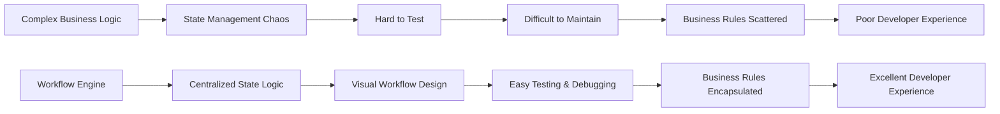
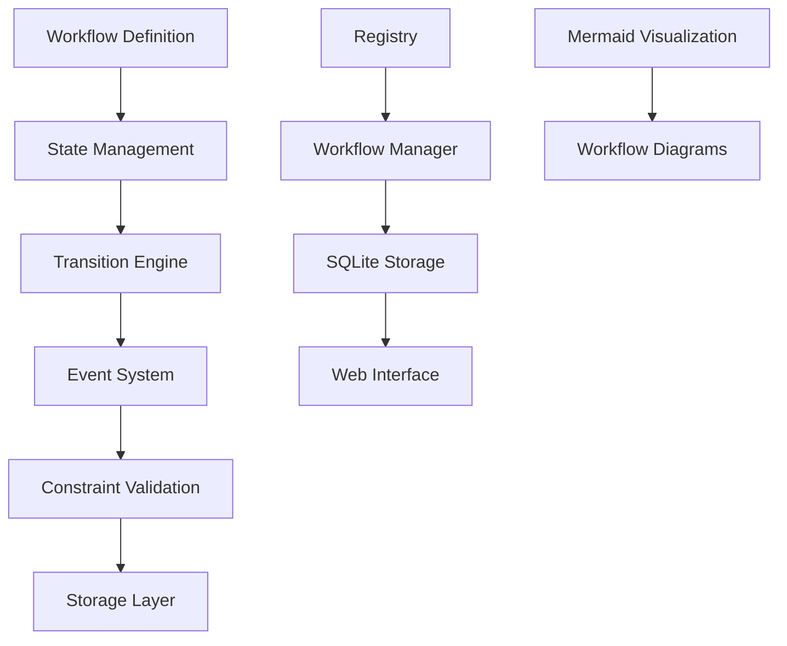
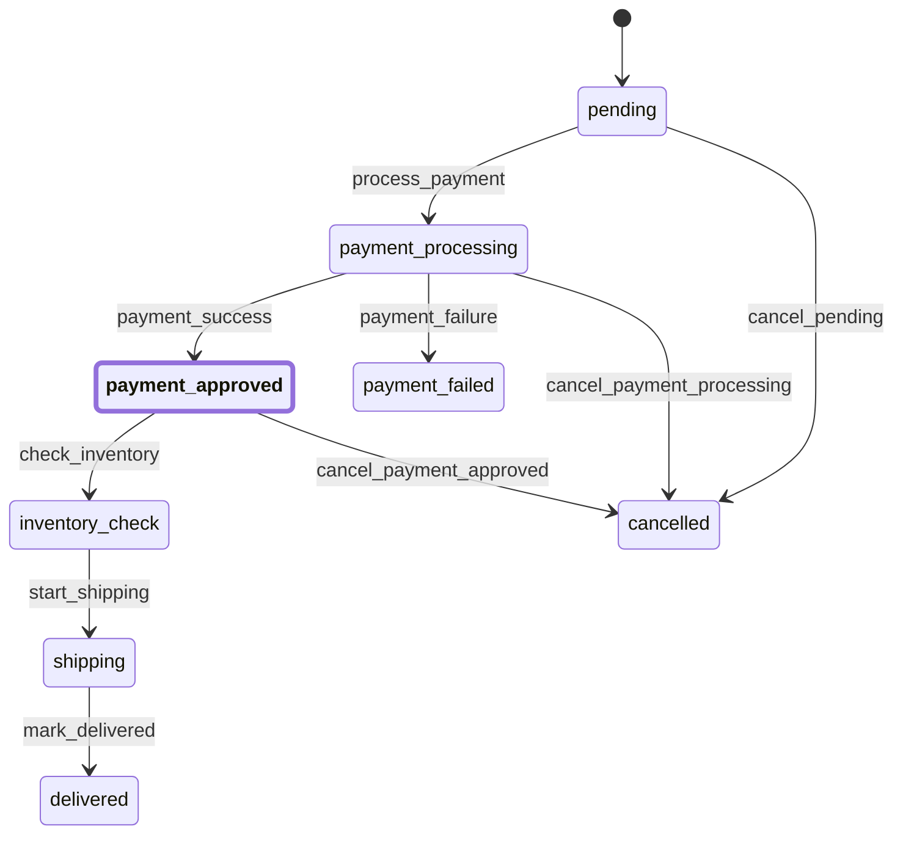

A deep dive into building a flexible, extensible workflow engine inspired by Symfony's Workflow Component

## 🆕 What's New in the Latest Updates?

> **Note:** This workflow engine is still under active development and is **not yet production-ready**. Community contributions, feedback, and real-world adoption are needed to help mature the project and ensure its stability for production use. If you're interested in contributing or trying it out, please check out the [GitHub repository](https://github.com/ehabterra/workflow) and get involved!

The [ehabterra/workflow](https://github.com/ehabterra/workflow) engine has seen major updates:

- **History Layer**: Pluggable, reusable, supports custom fields, pagination, and filtering. Includes a SQLite implementation for audit trails and workflow history.
- **Context-Aware Storage & Options Pattern**: Storage now supports custom fields and flexible options for advanced use cases.
- **REST API & Web Interface (Examples)**: Example REST endpoints and a web UI for workflow management are now included.
- **Mermaid Diagram Generation**: Improved visualization for workflow states and transitions.
- **Feature Checklist & Roadmap**: Updated to reflect YAML/JSON config, validation, dynamic loading, and more.

See the [GitHub repo](https://github.com/ehabterra/workflow) for full details and code examples.

**Ever wondered how complex business processes are orchestrated in modern applications?** From order processing to document approval workflows, the need for robust state management is universal. After working with Symfony's Workflow Component and seeing the gap in Go's ecosystem, I decided to build a comprehensive workflow engine that brings the power of Petri nets to Go applications.

The result? A flexible, thread-safe, and production-ready workflow engine that supports complex state transitions, event handling, and constraints. Let me walk you through the journey from concept to implementation.

## 🎯 The Problem: Why Build Another Workflow Engine?



### The Challenges I Faced:

1. **Scattered State Logic**: Business rules were scattered across multiple services
2. **Testing Nightmares**: Complex state transitions were hard to test and debug
3. **Visual Gap**: No way to visualize workflow states and transitions
4. **Thread Safety**: Concurrent access to workflow states was error-prone
5. **Persistence**: Workflow states needed to survive application restarts

## 🏗️ The Solution: Petri Net-Based Architecture

Petri nets provide a mathematical foundation for modeling concurrent systems. They're perfect for workflows because they can represent:

- **Places**: States in your workflow
- **Transitions**: Actions that move between states
- **Tokens**: Current state markers
- **Arcs**: Connections between places and transitions

### Core Architecture



## 🚀 Key Features That Make It Special

- **Thread-Safe Workflow Registry**: Manage multiple workflows concurrently with atomic operations.
- **Flexible, Context-Aware Storage**: Abstract storage interface with SQLite implementation, custom fields, and options pattern.
- **Event-Driven Architecture**: Add hooks for before/after transitions and guards.
- **Constraint System**: Attach business rules to transitions.
- **History & Audit Trail**: Track all transitions and context changes (see examples for SQLite history).
- **Mermaid Diagram Generation**: Visualize workflows for documentation and debugging.
- **REST API & Web Interface (Examples)**: Try the example server for workflow management.

### 1. Thread-Safe Workflow Registry

The registry manages multiple workflows with concurrent access:

```go
// Create a thread-safe registry
registry := workflow.NewRegistry()

// Add workflows safely
err := registry.AddWorkflow(wf)

// Get workflows with proper locking
wf, err := registry.Workflow("my-workflow")

// List all workflows
names := registry.ListWorkflows()
```

### 2. Flexible Storage Interface

The engine provides a clean storage abstraction:

```go
type Storage interface {
    LoadState(id string) ([]Place, error)
    SaveState(id string, places []Place) error
    DeleteState(id string) error
}
```

With a SQLite implementation included:

```go
// Create SQLite storage
storage := workflow.NewSQLiteStorage("workflows.db")

// Use with workflow manager
manager := workflow.NewManager(registry, storage)
```

### 3. Event-Driven Architecture

The event system allows for powerful workflow hooks:

```go
// Add event listeners
wf.AddEventListener(workflow.EventBeforeTransition, func(event workflow.Event) error {
    log.Printf("Before transition: %s", event.Transition().Name())
    return nil
})

wf.AddEventListener(workflow.EventAfterTransition, func(event workflow.Event) error {
    log.Printf("After transition: %s", event.Transition().Name())
    return nil
})
```

### 4. Constraint System

Add business rules to control when transitions can occur:

```go
type OrderAmountConstraint struct{}

func (c *OrderAmountConstraint) Validate(event workflow.Event) error {
    // Extract order amount from context
    amount, ok := event.Workflow.Context("order_amount")
    if !ok {
        return errors.New("order_amount not found in context")
    }
    
    // Validate minimum order amount
    if amount.(float64) < 100.0 {
        return errors.New("order amount must be at least $100")
    }
    
    return nil
}

// Add constraint to transition
tr.AddConstraint(&OrderAmountConstraint{})
```

## 📊 Real-World Example: E-commerce Order Processing

Let's build a complete order processing workflow:

```go
package main

import (
	"fmt"
	"log"

	"github.com/ehabterra/workflow"
)

func main() {
	// Define order places
	places := []workflow.Place{
		"pending",
		"payment_processing",
		"payment_approved",
		"payment_failed",
		"inventory_check",
		"shipping",
		"delivered",
		"cancelled",
	}

	// Define transitions
	transitions := []workflow.Transition{
		createTransition("process_payment", []workflow.Place{"pending"}, []workflow.Place{"payment_processing"}),
		createTransition("payment_success", []workflow.Place{"payment_processing"}, []workflow.Place{"payment_approved"}),
		createTransition("payment_failure", []workflow.Place{"payment_processing"}, []workflow.Place{"payment_failed"}),
		createTransition("check_inventory", []workflow.Place{"payment_approved"}, []workflow.Place{"inventory_check"}),
		createTransition("start_shipping", []workflow.Place{"inventory_check"}, []workflow.Place{"shipping"}),
		createTransition("mark_delivered", []workflow.Place{"shipping"}, []workflow.Place{"delivered"}),
		createTransition("cancel_pending", []workflow.Place{"pending"}, []workflow.Place{"cancelled"}),
		createTransition("cancel_payment_processing", []workflow.Place{"payment_processing"}, []workflow.Place{"cancelled"}),
		createTransition("cancel_payment_approved", []workflow.Place{"payment_approved"}, []workflow.Place{"cancelled"}),
	}

	// Create workflow definition
	definition, err := workflow.NewDefinition(places, transitions)
	if err != nil {
		log.Fatal(err)
	}

	// Create workflow instance
	wf, err := workflow.NewWorkflow("order-123", definition, "pending")
	if err != nil {
		log.Fatal(err)
	}

	// Add order context
	wf.SetContext("order_amount", 150.0)
	wf.SetContext("customer_id", "cust-456")

	// Add event listeners for business logic
	wf.AddEventListener(workflow.EventBeforeTransition, func(event workflow.Event) error {
		log.Printf("Processing transition: %s", event.Transition().Name())
		return nil
	})

	wf.AddEventListener(workflow.EventAfterTransition, func(event workflow.Event) error {
		log.Printf("Completed transition: %s", event.Transition().Name())
		return nil
	})

	// Process the order
	if err := wf.Apply([]workflow.Place{"payment_processing"}); err != nil {
		log.Fatal(err)
	}

	if err := wf.Apply([]workflow.Place{"payment_approved"}); err != nil {
		log.Fatal(err)
	}

	// Get current places
	currentPlaces := wf.CurrentPlaces()
	fmt.Printf("Current places: %v\n", currentPlaces)

	// Generate workflow mermaid diagram
	diagram := wf.Diagram()
	fmt.Println(diagram)
}

func createTransition(name string, from, to []workflow.Place) workflow.Transition {
	tr, err := workflow.NewTransition(name, from, to)
	if err != nil {
		log.Fatal(err)
	}
	return *tr
}
```

## 🎨 Visual Workflow Design with Mermaid

The engine generates beautiful workflow diagrams:



## 🔧 Advanced Features

### 1. Parallel Transitions & Branching

Support for concurrent transitions and workflow branches:

```go
// Apply multiple transitions simultaneously
err := wf.Apply([]workflow.Place{"payment_processing", "inventory_check"})
```

### 2. History Layer & Audit Trail

Track every transition, actor, and context change:

```go
import "github.com/ehabterra/workflow/history"

historyStore := history.NewSQLiteHistory(db,
    history.WithCustomFields(map[string]string{
        "ip_address": "ip_address TEXT",
    }),
)
historyStore.Initialize()

// Save a transition with custom fields
historyStore.SaveTransition(&history.TransitionRecord{
    WorkflowID: "wf1",
    FromState:  "draft",
    ToState:    "review",
    Transition: "submit",
    Notes:      "Submitted for review",
    Actor:      "alice",
    CreatedAt:  time.Now(),
    CustomFields: map[string]interface{}{
        "ip_address": "127.0.0.1",
    },
})

// List history with pagination
records, err := historyStore.ListHistory("wf1", history.QueryOptions{Limit: 10, Offset: 0})
for _, rec := range records {
    fmt.Println(rec.FromState, rec.ToState, rec.Notes, rec.CustomFields["ip_address"])
}
```

### 3. REST API & Web Interface (Examples)

The repo includes example REST endpoints and a web UI for managing workflows, transitions, and history.

### 4. YAML/JSON Configuration (Planned)

Support for loading workflow definitions from YAML/JSON is on the roadmap.

## 🎯 Use Cases

The workflow engine is perfect for:

- **E-commerce**: Order processing, inventory management
- **Document Management**: Approval workflows, content publishing
- **Task Management**: Project workflows, issue tracking
- **Financial Services**: Loan processing, payment workflows
- **Healthcare**: Patient care workflows, medical approvals
- **DevOps**: Deployment pipelines, release management

## 🔮 Future Roadmap

### High Priority
- [ ] YAML/JSON configuration support
- [ ] Standalone web interface for workflow management
- [ ] Enhanced REST API endpoints
- [ ] Workflow validation system
- [ ] Dynamic workflow definition loading

### Medium Priority
- [ ] Custom scripting for transition conditions
- [ ] Workflow versioning
- [ ] Workflow templates
- [ ] Role-based access control
- [ ] Workflow timeout and scheduling

### Low Priority
- [ ] Workflow statistics and analytics
- [ ] Export/Import workflow definitions

For the latest features and examples, see the [GitHub repository](https://github.com/ehabterra/workflow).

## 🤝 Contributing

The project is open source and welcomes contributions! Here's how you can help:

1. **Report Issues**: Found a bug? Create an issue with detailed steps
2. **Feature Requests**: Have an idea? Open a feature request
3. **Code Contributions**: Submit pull requests for improvements
4. **Documentation**: Help improve docs and examples
5. **Testing**: Add test cases and improve coverage

## 📚 Resources

- [GitHub Repository](https://github.com/ehabterra/workflow)
- [Symfony Workflow Component](https://symfony.com/doc/current/workflow.html)
- [Petri Net Theory](https://en.wikipedia.org/wiki/Petri_net)
- [Go Concurrency Patterns](https://go.dev/blog/pipelines)

## 🎉 Conclusion

Building this workflow engine has been an incredible journey. From the initial concept inspired by Symfony's Workflow Component to a production-ready Go package, the project demonstrates the power of:

- **Mathematical Foundations**: Petri nets provide a solid theoretical base
- **Go's Strengths**: Concurrency, performance, and simplicity
- **Open Source**: Community-driven development and feedback
- **Practical Design**: Real-world use cases and production considerations

The engine is still under active development and **not yet production-ready**. It continues to evolve based on community feedback, contributions, and real-world adoption. Whether you're interested in building a simple state machine or a complex business process orchestration system, your feedback and contributions are essential to help make this workflow engine robust and production-grade. Try it out, share your experiences, and help shape its future!

**Ready to build your next workflow?** Check out the [GitHub repository](https://github.com/ehabterra/workflow) and start orchestrating your business processes with confidence!

---

*What workflows are you planning to build? Share your use cases in the comments below!* 