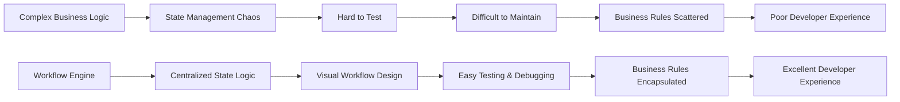
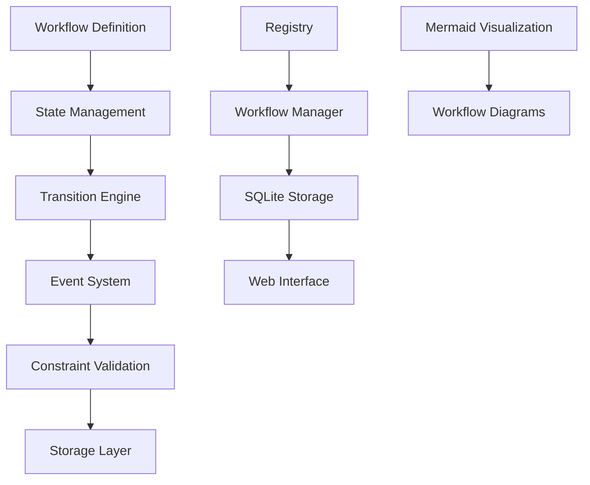
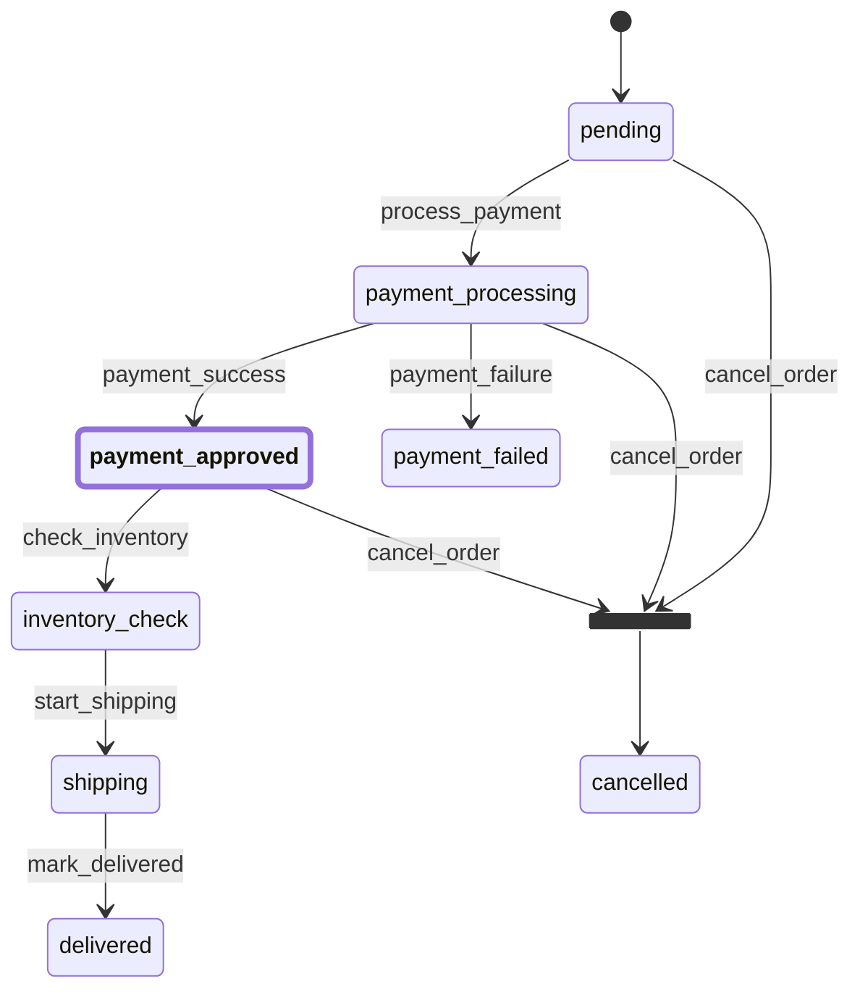

A deep dive into building a flexible, extensible workflow engine inspired by Symfony's Workflow Component

**Ever wondered how complex business processes are orchestrated in modern applications?** From order processing to document approval workflows, the need for robust state management is universal. After working with Symfony's Workflow Component and seeing the gap in Go's ecosystem, I decided to build a comprehensive workflow engine that brings the power of Petri nets to Go applications.

The result? A flexible, thread-safe, and production-ready workflow engine that supports complex state transitions, event handling, and constraints. Let me walk you through the journey from concept to implementation.

## 🎯 The Problem: Why Build Another Workflow Engine?



### The Challenges I Faced:

1. **Scattered State Logic**: Business rules were scattered across multiple services
2. **Testing Nightmares**: Complex state transitions were hard to test and debug
3. **Visual Gap**: No way to visualize workflow states and transitions
4. **Thread Safety**: Concurrent access to workflow states was error-prone
5. **Persistence**: Workflow states needed to survive application restarts

## 🏗️ The Solution: Petri Net-Based Architecture

Petri nets provide a mathematical foundation for modeling concurrent systems. They're perfect for workflows because they can represent:

- **Places**: States in your workflow
- **Transitions**: Actions that move between states
- **Tokens**: Current state markers
- **Arcs**: Connections between places and transitions

### Core Architecture



## 🚀 Key Features That Make It Special

### 1. Thread-Safe Workflow Registry

The registry manages multiple workflows with concurrent access:

```go
// Create a thread-safe registry
registry := workflow.NewRegistry()

// Add workflows safely
err := registry.AddWorkflow(wf)

// Get workflows with proper locking
wf, err := registry.Workflow("my-workflow")

// List all workflows
names := registry.ListWorkflows()
```

### 2. Flexible Storage Interface

The engine provides a clean storage abstraction:

```go
type Storage interface {
    LoadState(id string) ([]Place, error)
    SaveState(id string, places []Place) error
    DeleteState(id string) error
}
```

With a SQLite implementation included:

```go
// Create SQLite storage
storage := workflow.NewSQLiteStorage("workflows.db")

// Use with workflow manager
manager := workflow.NewManager(registry, storage)
```

### 3. Event-Driven Architecture

The event system allows for powerful workflow hooks:

```go
// Add event listeners
wf.AddEventListener(workflow.EventBeforeTransition, func(event workflow.Event) error {
    log.Printf("Before transition: %s", event.Transition())
    return nil
})

wf.AddEventListener(workflow.EventAfterTransition, func(event workflow.Event) error {
    log.Printf("After transition: %s", event.Transition())
    return nil
})
```

### 4. Constraint System

Add business rules to control when transitions can occur:

```go
type OrderAmountConstraint struct{}

func (c *OrderAmountConstraint) Validate(event workflow.Event) error {
    // Extract order amount from context
    amount, ok := event.Workflow.Context("order_amount")
    if !ok {
        return errors.New("order_amount not found in context")
    }
    
    // Validate minimum order amount
    if amount.(float64) < 100.0 {
        return errors.New("order amount must be at least $100")
    }
    
    return nil
}

// Add constraint to transition
tr.AddConstraint(&OrderAmountConstraint{})
```

## 📊 Real-World Example: E-commerce Order Processing

Let's build a complete order processing workflow:

```go
package main

import (
    "fmt"
    "log"
    "github.com/ehabterra/workflow"
)

func main() {
    // Define order places
    places := []workflow.Place{
        "pending",
        "payment_processing", 
        "payment_approved",
        "payment_failed",
        "inventory_check",
        "shipping",
        "delivered",
        "cancelled",
    }

    // Define transitions
    transitions := []workflow.Transition{
        createTransition("process_payment", []workflow.Place{"pending"}, []workflow.Place{"payment_processing"}),
        createTransition("payment_success", []workflow.Place{"payment_processing"}, []workflow.Place{"payment_approved"}),
        createTransition("payment_failure", []workflow.Place{"payment_processing"}, []workflow.Place{"payment_failed"}),
        createTransition("check_inventory", []workflow.Place{"payment_approved"}, []workflow.Place{"inventory_check"}),
        createTransition("start_shipping", []workflow.Place{"inventory_check"}, []workflow.Place{"shipping"}),
        createTransition("mark_delivered", []workflow.Place{"shipping"}, []workflow.Place{"delivered"}),
        createTransition("cancel_order", []workflow.Place{"pending", "payment_processing", "payment_approved"}, []workflow.Place{"cancelled"}),
    }

    // Create workflow definition
    definition, err := workflow.NewDefinition(places, transitions)
    if err != nil {
        log.Fatal(err)
    }

    // Create workflow instance
    wf, err := workflow.NewWorkflow("order-123", definition, "pending")
    if err != nil {
        log.Fatal(err)
    }

    // Add order context
    wf.SetContext("order_amount", 150.0)
    wf.SetContext("customer_id", "cust-456")

    // Add event listeners for business logic
    wf.AddEventListener(workflow.EventBeforeTransition, func(event workflow.Event) error {
        log.Printf("Processing transition: %s", event.Transition())
        return nil
    })

    wf.AddEventListener(workflow.EventAfterTransition, func(event workflow.Event) error {
        log.Printf("Completed transition: %s", event.Transition())
        return nil
    })

    // Process the order
    if err := wf.Apply([]workflow.Place{"payment_processing"}); err != nil {
        log.Fatal(err)
    }

    if err := wf.Apply([]workflow.Place{"payment_approved"}); err != nil {
        log.Fatal(err)
    }

    // Get current places
    currentPlaces := wf.CurrentPlaces()
    fmt.Printf("Current places: %v\n", currentPlaces)

    // Generate workflow diagram
    diagram := wf.GenerateMermaidDiagram()
    fmt.Println(diagram)
}

func createTransition(name string, from, to []workflow.Place) workflow.Transition {
    tr, err := workflow.NewTransition(name, from, to)
    if err != nil {
        log.Fatal(err)
    }
    return *tr
}
```

## 🎨 Visual Workflow Design with Mermaid

The engine generates beautiful workflow diagrams:



## 🔧 Advanced Features

### 1. Parallel Transitions

Support for concurrent place transitions:

```go
// Apply multiple transitions simultaneously
err := wf.Apply([]workflow.Place{"payment_processing", "inventory_check"})
```

### 2. Workflow Manager

High-level interface for workflow lifecycle management:

```go
// Create manager with storage
manager := workflow.NewManager(registry, storage)

// Create and persist workflow
wf, err := manager.CreateWorkflow("order-123", definition, "pending")
if err != nil {
    log.Fatal(err)
}

// Load workflow from storage
wf, err = manager.GetWorkflow("order-123", definition)
if err != nil {
    log.Fatal(err)
}

// Save workflow state
err = manager.SaveWorkflow("order-123", wf)
if err != nil {
    log.Fatal(err)
}
```

### 3. Context Management

Attach arbitrary data to workflows:

```go
// Set context values
wf.SetContext("order_amount", 150.0)
wf.SetContext("customer_id", "cust-456")
wf.SetContext("metadata", map[string]interface{}{
    "source": "web",
    "priority": "high",
})

// Retrieve context values
amount, ok := wf.Context("order_amount")
if ok {
    fmt.Printf("Order amount: $%.2f\n", amount.(float64))
}
```

## 🧪 Testing Your Workflows

The engine makes testing workflows straightforward:

```go
func TestOrderWorkflow(t *testing.T) {
    // Create test workflow
    definition := createOrderDefinition()
    wf, err := workflow.NewWorkflow("test-order", definition, "pending")
    require.NoError(t, err)

    // Test valid transition
    err = wf.Apply([]workflow.Place{"payment_processing"})
    assert.NoError(t, err)
    assert.Contains(t, wf.CurrentPlaces(), "payment_processing")

    // Test invalid transition
    err = wf.Apply([]workflow.Place{"delivered"})
    assert.Error(t, err)

    // Test constraint validation
    wf.SetContext("order_amount", 50.0) // Below minimum
    err = wf.Apply([]workflow.Place{"payment_approved"})
    assert.Error(t, err)
}
```

## 📈 Performance Benchmarks

The engine is optimized for high-performance scenarios:

```bash
# Run benchmarks
go test -benchmem -run=^$ -bench=. ./...

# Example results:
goos: darwin
goarch: amd64
pkg: github.com/ehabterra/workflow
cpu: Intel(R) Core(TM) i9-9880H CPU @ 2.30GHz
=== RUN   BenchmarkNewWorkflow
BenchmarkNewWorkflow
BenchmarkNewWorkflow-16                          7428621               156.6 ns/op            216 B/op          5 allocs/op
=== RUN   BenchmarkWorkflow_Apply
BenchmarkWorkflow_Apply
BenchmarkWorkflow_Apply-16                       1876570               543.2 ns/op            712 B/op         14 allocs/op
...
```

### Understanding the Benchmarks

- **156.6 ns/op**: Creating a new workflow takes only 156 nanoseconds (7.4M workflows/second)
- **543.2 ns/op**: Applying transitions takes 543 nanoseconds (1.8M transitions/second)
- **216 B/op**: Memory allocation per workflow creation (very efficient)
- **712 B/op**: Memory allocation per transition (minimal overhead)
- **5-14 allocs/op**: Number of memory allocations (excellent for GC pressure)

These results demonstrate that the engine can handle high-throughput scenarios with minimal resource overhead, making it suitable for production workloads.

## 🚀 Getting Started

### Installation

```bash
go get github.com/ehabterra/workflow
```

### Quick Start

```go
package main

import (
    "fmt"
    "github.com/ehabterra/workflow"
)

func main() {
    // Create a simple workflow
    definition, _ := workflow.NewDefinition(
        []workflow.Place{"start", "middle", "end"},
        []workflow.Transition{
            *createTransition("to-middle", []workflow.Place{"start"}, []workflow.Place{"middle"}),
            *createTransition("to-end", []workflow.Place{"middle"}, []workflow.Place{"end"}),
        },
    )

    wf, _ := workflow.NewWorkflow("my-workflow", definition, "start")
    
    // Apply transitions
    wf.Apply([]workflow.Place{"middle"})
    wf.Apply([]workflow.Place{"end"})
    
    fmt.Printf("Current places: %v\n", wf.CurrentPlaces())
}
```

## 🔧 Troubleshooting Common Issues

### 1. "Invalid transition" errors

**Problem**: `workflow: invalid transition: cannot apply transition "x" from current places`

**Solution**: Ensure the transition's input places match your current workflow state:

```go
// Check current places before applying transition
currentPlaces := wf.CurrentPlaces()
fmt.Printf("Current places: %v\n", currentPlaces)

// Apply transition (validation is included)
err := wf.Apply([]workflow.Place{"target_place"})
if err != nil {
    log.Printf("Transition failed: %v", err)
    // Handle the error appropriately
}
```

### 2. Constraint validation failures

**Problem**: Transitions fail with constraint errors

**Solution**: Check that required context values are set:

```go
// Set required context before applying transition
wf.SetContext("order_amount", 150.0)
wf.SetContext("customer_id", "cust-123")

// Apply transition
err := wf.Apply([]workflow.Place{"payment_processing"})
if err != nil {
    log.Printf("Constraint failed: %v", err)
}
```

### 3. Concurrent access issues

**Problem**: Race conditions when multiple goroutines access the same workflow

**Solution**: Use the thread-safe registry or implement proper synchronization:

```go
// Use registry for thread-safe access
registry := workflow.NewRegistry()
registry.AddWorkflow(wf)

// Get workflow safely from multiple goroutines
wf, err := registry.Workflow("my-workflow")
if err != nil {
    log.Printf("Workflow not found: %v", err)
}
```

### 4. Storage persistence issues

**Problem**: Workflow state not persisting between application restarts

**Solution**: Ensure proper storage initialization and error handling:

```go
// Initialize storage with error handling
storage := workflow.NewSQLiteStorage("workflows.db")
if err := storage.Initialize(); err != nil {
    log.Fatalf("Failed to initialize storage: %v", err)
}

// Save workflow state explicitly
manager := workflow.NewManager(registry, storage)
if err := manager.SaveWorkflow("my-workflow", wf); err != nil {
    log.Printf("Failed to save workflow: %v", err)
}
```

### 5. Memory leaks with event listeners

**Problem**: Event listeners accumulating over time

**Solution**: Remove listeners when no longer needed:

```go
// Store listener reference for removal
listener := func(event workflow.Event) error {
    log.Printf("Transition: %s", event.Transition())
    return nil
}

// Add listener
wf.AddEventListener(workflow.EventBeforeTransition, listener)

// Remove listener when done
wf.RemoveEventListener(workflow.EventBeforeTransition, listener)
```

## 🎯 Use Cases

The workflow engine is perfect for:

- **E-commerce**: Order processing, inventory management
- **Document Management**: Approval workflows, content publishing
- **Task Management**: Project workflows, issue tracking
- **Financial Services**: Loan processing, payment workflows
- **Healthcare**: Patient care workflows, medical approvals
- **DevOps**: Deployment pipelines, release management

## 🔮 Future Roadmap

### High Priority
- [ ] YAML/JSON configuration support
- [ ] Standalone web interface
- [ ] Enhanced REST API endpoints
- [ ] Workflow validation system
- [ ] Dynamic workflow definition loading

### Medium Priority
- [ ] Custom scripting for transition conditions
- [ ] Workflow versioning
- [ ] Workflow templates
- [ ] Role-based access control
- [ ] Workflow timeout and scheduling

### Low Priority
- [ ] Workflow statistics and analytics
- [ ] Export/Import workflow definitions

## 🤝 Contributing

The project is open source and welcomes contributions! Here's how you can help:

1. **Report Issues**: Found a bug? Create an issue with detailed steps
2. **Feature Requests**: Have an idea? Open a feature request
3. **Code Contributions**: Submit pull requests for improvements
4. **Documentation**: Help improve docs and examples
5. **Testing**: Add test cases and improve coverage

## 📚 Resources

- [GitHub Repository](https://github.com/ehabterra/workflow)
- [Symfony Workflow Component](https://symfony.com/doc/current/workflow.html)
- [Petri Net Theory](https://en.wikipedia.org/wiki/Petri_net)
- [Go Concurrency Patterns](https://go.dev/blog/pipelines)

## 🎉 Conclusion

Building this workflow engine has been an incredible journey. From the initial concept inspired by Symfony's Workflow Component to a production-ready Go package, the project demonstrates the power of:

- **Mathematical Foundations**: Petri nets provide a solid theoretical base
- **Go's Strengths**: Concurrency, performance, and simplicity
- **Open Source**: Community-driven development and feedback
- **Practical Design**: Real-world use cases and production considerations

The engine is now ready for production use and continues to evolve based on community feedback and real-world requirements. Whether you're building a simple state machine or a complex business process orchestration system, this workflow engine provides the flexibility and reliability you need.

**Ready to build your next workflow?** Check out the [GitHub repository](https://github.com/ehabterra/workflow) and start orchestrating your business processes with confidence!

---

*What workflows are you planning to build? Share your use cases in the comments below!* 