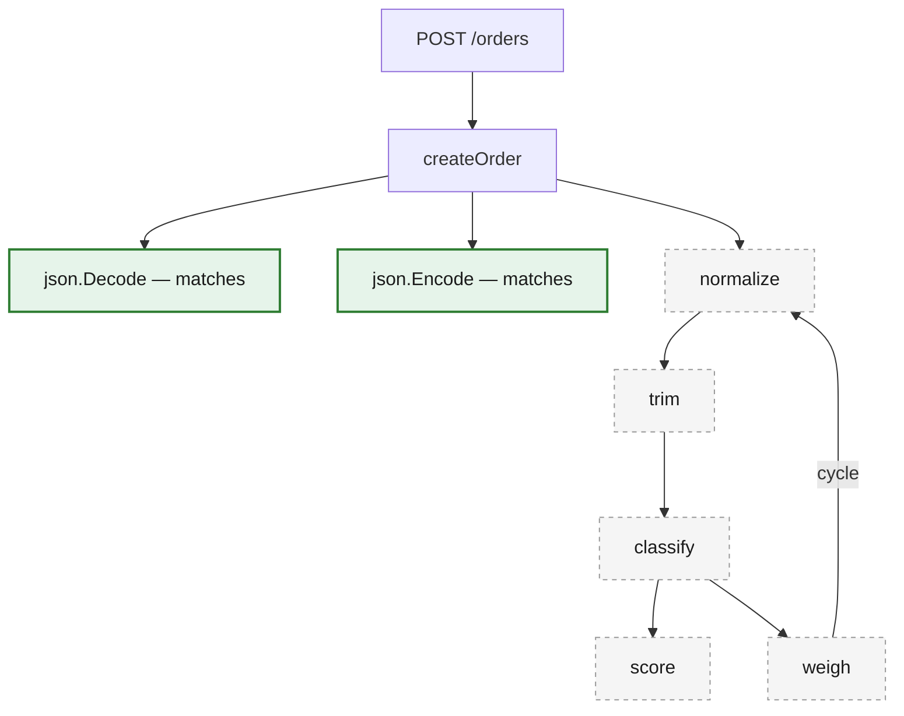
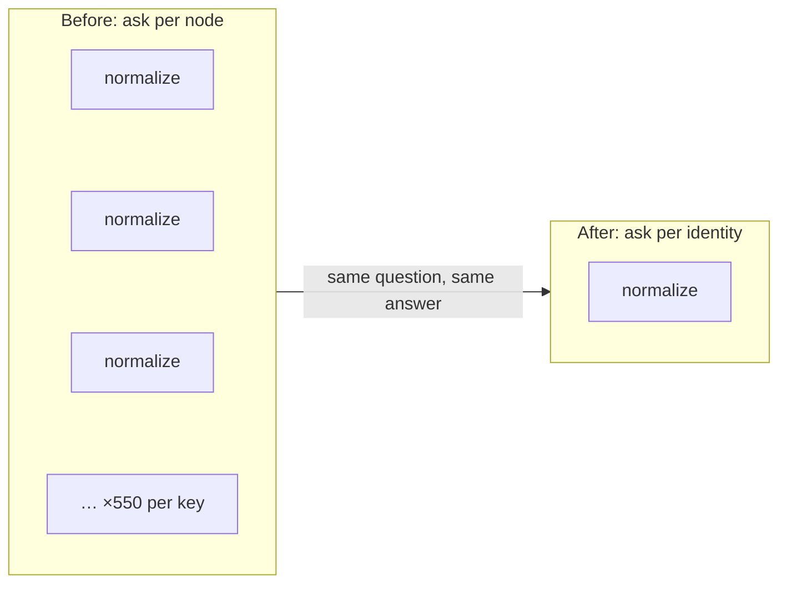
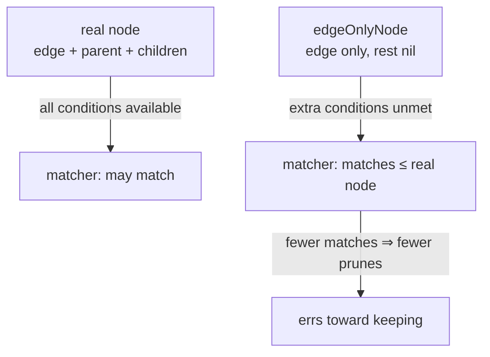
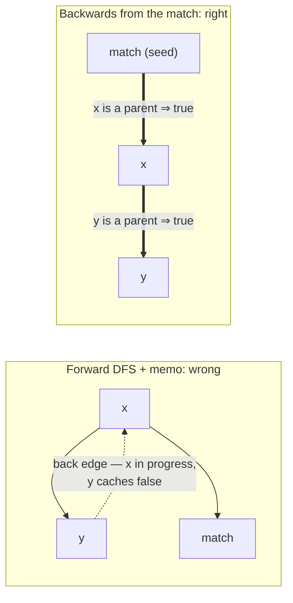

## Why this tool walks your code at all

[apispec](https://github.com/ehabterra/apispec) reads Go source and writes an OpenAPI spec from it. The usual alternative is annotation comments above every handler, and those drift: someone edits the handler, forgets the comment, and the documentation is now politely lying. Generating from the code itself is the whole point.

But the code doesn't hand you a spec. A route registration says "POST /orders goes to createOrder" and stops there — what the endpoint actually accepts and returns lives in the handler's body, often several calls deep, behind a binding helper here and a response wrapper there. The only way to find it is to follow the calls, so that's what the tool does.

On a small service that walk is instant. On a big module it got slow — and honestly, slow wasn't even the bad part. The walk has budgets, because it has to — dense call graphs expand forever without them — and when a run hits one, it stops early and the spec quietly documents less than the truth. No error. Just an API document with things missing.

So this is the story of making the walk cheap enough that the budgets stop biting. It ends somewhere I didn't see coming: on one project, the optimised build produced a *bigger* spec.

## The number that embarrassed me

Inside the tool, the walk starts at each route registration and expands the call graph down to the real handler into what the code calls a "tracker tree". An extraction pass then walks that tree asking a set of *matchers* — one family each for routes, mounts, security, request bodies, responses and parameters — which nodes have something to say about the spec.

Here's the design decision that came back to bite me: the tree materialises one node per *path*. A helper reachable along ten thousand distinct paths gets built ten thousand times. I knew that was wasteful in principle; I had no idea how wasteful until I put a counter in:

```
distinct callee keys                       =    12,882
nodes materialised                         = 7,147,505
nodes visited by the extraction walk       = 7,103,742
nodes whose ENTIRE subtree matched nothing = 6,930,424   (97.6%)
nodes that ever matched                    =   104,156    (1.5%)
```

That's a 163-route service. I built 7.1 million nodes to consult 104 thousand of them. Everything else was string utilities, validation helpers, logging — code that can't possibly say anything about an API, rebuilt once per path, visited, and thrown away.



The dashed part is where the millions live. On a real project it isn't five helpers, it's most of the codebase, and the per-path unfolding multiplies it by every path that reaches it.

## The obvious idea, and the catch

The idea is as old as it gets: before descending into a subtree, ask whether anything down there could possibly be interesting, and skip it if not. I'd been circling it for a while.

The catch is the word *possibly*. The answer has to be **provably** no, not probably no — and I sat on this (issue [#318](https://github.com/ehabterra/apispec/issues/318)) longer than I'd like to admit, because a wrong "no" in a tool like this doesn't crash anything. I'll come back to what it does instead.

## Why it wasn't a gamble here

What saved me is a property the codebase had already committed to, for a different reason. Every matcher family's `MatchNode` is a **pure function of the call edge** — the callee's name, receiver and package, the caller's name. The extractor documents this and leans on it for its per-edge matcher memos; only the *extraction* step, which runs after a match, cares about a node's ancestry.

Which means "does this subtree contain anything a matcher would accept" is a property of **content identity**, not of path. `normalize` matches nothing whether you reached it through `createOrder` or `listOrders` or forty layers of middleware.

And that's exactly what the per-path unfolding couldn't exploit on its own — it was re-asking the same question millions of times about the same handful of distinct identities. So I compute the answer once over the *plan graph* — the ~12,900 content identities — instead of over the unfolded tree of 7.1 million nodes.



Three orders of magnitude fewer questions, before a single node is saved. (If the move feels familiar, it's the one [hash consing](https://en.wikipedia.org/wiki/Hash_consing) makes: one answer per distinct content, not one per occurrence.)

## The part that scared me

I'll be honest about why I nearly didn't ship this. A bad prune here doesn't crash and doesn't log a wrong number. It produces a **silently smaller spec**.

Skip one subtree that should have contributed, and a route, a request body, or a response quietly disappears from someone's API documentation. Nobody gets an error. The spec just says less than the truth and looks completely fine doing it. For a tool whose whole job is telling the truth about an API, that's worse than slow — slow is visible, wrong is not.

Three things let me sleep.

**The predicate keeps anything that can reach a match.** It's not "does this node match" — it's "can this node's subtree *reach* a match". A barren ancestor of a matching node still gets built. So the extraction step that walks **up** from a matching node to resolve provenance is untouched: nothing a kept node can reach is ever pruned. If your first reaction to pruning was "but I need the parents later" — mine too, and this is the answer. The parents of anything that matters are, by construction, things that matter.

If that shape rings a bell, it's the mark phase of a [tracing garbage collector](https://en.wikipedia.org/wiki/Tracing_garbage_collection): seed from the things you care about — roots there, goals here — and keep the transitive closure. It's also close kin to a backward [program slice](https://en.wikipedia.org/wiki/Program_slicing), Weiser's old question of what can affect this point.

**The prune over-approximates on purpose.** To evaluate a matcher for an edge before any node exists, I hand it a stand-in — `edgeOnlyNode` — that carries the edge and answers everything else as an unparented, childless node.

```go
type edgeOnlyNode struct{ edge *metadata.CallGraphEdge }

func (n edgeOnlyNode) GetParent() TrackerNodeInterface     { return nil }
func (n edgeOnlyNode) GetChildren() []TrackerNodeInterface { return nil }
func (n edgeOnlyNode) GetEdge() *metadata.CallGraphEdge    { return n.edge }
```

Today every `MatchNode` reads only `GetEdge()`. But say someone later writes a matcher that does consult ancestry. Through the stand-in it sees "no ancestry", and since every such check is a further condition to satisfy, it can only match **fewer** things than the real node would — never more. Fewer matches through the stand-in means fewer prunes, not more; the error falls toward keeping. That's the soundness-versus-precision trade every static analyser makes somewhere, and the [soundiness manifesto](https://soundiness.org) is the honest read on it.



**Every family is on the roll call.** The base predicate, `edgeMatchesAnyFamily`, ORs across all six matcher families, and every family the extraction walk consults *has* to be in that list. Leave one out and the prune drops subtrees that family would have matched — routes going quietly missing, the exact failure this whole thing guards against. I wrote that warning into the code comment in capitals, because it's the maintenance hazard here: a future seventh family has to show up to the roll call.

## The trap I nearly walked into

The reachability computation itself has one genuinely nasty trap in it, and it's the part of this I'd most want someone to steal.

My first instinct was a forward DFS with memoisation: can `x` reach a match? Ask its children, cache the answer. Over a DAG that works. Over a call graph — cycles everywhere — it's wrong in a very quiet way.

Take `x → y`, `y → x` (a back edge), and `x → match`. The DFS enters `x`, recurses into `y`, and `y` asks about `x` — which is still *in progress*, so the cycle guard says no. `y` caches `false`. But `y → x → match` is a perfectly good path; the memo is poisoned, and fixing it forwards means condensing the strongly connected components first — [Tarjan's algorithm](https://en.wikipedia.org/wiki/Tarjan%27s_strongly_connected_components_algorithm) territory — or making repeated passes.

So I ran the fixpoint **backwards** instead. While enumerating identities forwards I record *reverse* edges, seed the reachable-set with the identities whose own edge matches, then propagate: any parent of a reachable identity is reachable, until nothing changes. Reachability is a [least fixpoint](https://en.wikipedia.org/wiki/Least_fixed_point) over an OR, propagating from the goals reaches exactly the identities with a path to one — and cycles simply stop being a case.

The reassuring part is that none of this is clever. It's textbook backwards [dataflow analysis](https://en.wikipedia.org/wiki/Data-flow_analysis) — the same direction [liveness analysis](https://en.wikipedia.org/wiki/Live-variable_analysis) runs, propagating from uses back toward definitions — and the propagate-until-quiet loop is a bog-standard worklist. I only really trusted it once I recognised the shape.



Both passes are linear. There's a unit test pinning exactly the `x → y → x` shape, because this is the kind of bug that sails through every acyclic test you write.

## What I got back

Mapping-stage times, minima of three interleaved pairs:

```
163-route service   6.06s -> 2.67s    nodes 7,147,505 -> 405,490  (-94.3%)
                                      peak RSS 1145MB -> 522MB    (-54%)
the apispec repo    6.58s -> 0.58s
```

On the 163-route service the output is **byte-identical**, and deterministic across runs. That empty diff is the proof I actually cared about — not the benchmark.

## Then the diff wasn't empty

On the apispec repo itself, the output *changed*. My stomach dropped when the diff came back non-empty — this was exactly the failure I'd spent weeks being afraid of. Then I read it, and it had only **gained**.

Remember the budgets — a per-route node cap, an instance cap on repeated call copies. The un-pruned baseline had been exhausting its per-route budget on 6 of 36 routes and dropping 8,706,027 call copies at the instance cap. Response bodies were silently missing from those routes, and had been for as long as anyone had run the tool on this repo.

Pruning stopped spending the budget on barren subtrees, so it reached the parts that mattered, and the bodies came back. The instance cap went from dropping 3,624,817 copies to 509,218.

I wanted to be sure the pruned output was actually *converged*, not just differently truncated. So I raised both caps 20× on the pruned build — nothing changed. The same raise on the baseline didn't terminate in ten minutes.

That's the effect I keep coming back to. When a system truncates under a budget, removing waste doesn't just save time — it converts straight into output. "Faster *and* better" usually smells like marketing; under a budget it's just arithmetic.

## Shipping it without breaking anyone

The predicate belongs to the extractor, since the matcher families are its own — it installs the memoised edge predicate into the tree at setup. A nil predicate is the off switch and the default: `canReachMatch` answers `true` unconditionally without one. So anything that wants the full unfolding simply never installs one — the diagram server, which builds its own eager tree and never runs the extractor, doesn't even know the prune exists.

For a regression guard I built a fixture, `testdata/barren_subtree` ([PR #348](https://github.com/ehabterra/apispec/pull/348)): two routes wrapped around a deliberately dense, mutually recursive utility layer that matches nothing. The test asserts the paths, the request body, the status-coded response and the array response all survive, and its output is identical with and without pruning — so it's a **change detector**, not a test of the speedup. If a future edit to the predicate ever eats a route, that test flips, loudly.

## What I'm keeping from this

If you're staring at your own too-slow traversal, here's what this one taught me, roughly in the order it taught me:

- I guessed "a lot of waste"; the counter said 97.6% barren against 1.5% useful. Counting consulted-versus-visited before touching anything is what justified the whole effort — and it pointed me at the walk itself, not the per-node cost.
- The step that turned millions of questions into thousands wasn't the worklist loop — it was finding the invariant that made the answer path-independent. Here that was "matchers are pure in the edge", and it was the actual work.
- I'd never prune on "does this look useful". Reachability is provable; "looks useful" is a heuristic, and a heuristic inside a prune is silent data loss on a delay.
- The over-approximation was deliberate, and I could say exactly which way its error falls: anything the stand-in withholds can only cause keeping, never dropping. I wouldn't ship a prune where I couldn't finish that sentence.
- Whatever the later stages walk *up* into had to survive, not just what they read. "Can reach a match" bought me every such ancestor for free.
- Cycles are what pushed me to run the fixpoint backwards from the goal. The forward memoised DFS was my first draft, and its premature cached negatives would have been a production bug — the quiet kind.
- I went hunting for every consumer of the walk: every matcher family in the predicate, every caller of the tree accounted for or opted out via the nil default. The one you forget is a hole nobody sees.
- The proof I trusted was a byte-identical diff on real output, plus a fixture that fails loud. The benchmark told me it was fast; only the diff told me it was right.
- And under a budget, saved work is found output. That's where the extra spec content came from.

One honest note to end on: none of this transfers as a recipe. The prune was sound because of a property specific to this system — matchers pure in the edge — and without that, everything above is just a fast way to lose data. Finding your system's version of that property is the job; the loop that exploits it is an afternoon.

## Further reading

Signposts, in case any of this itched:

- [Data-flow analysis](https://en.wikipedia.org/wiki/Data-flow_analysis) — the general frame; the prune's fixpoint is one tiny instance of it.
- [Live-variable analysis](https://en.wikipedia.org/wiki/Live-variable_analysis) — the classic backwards problem. If you've ever written liveness, you've already written this post's core loop.
- [Tarjan's SCC algorithm](https://en.wikipedia.org/wiki/Tarjan%27s_strongly_connected_components_algorithm) — what I'd have needed if I'd insisted on going forwards through the cycles.
- [Program slicing](https://en.wikipedia.org/wiki/Program_slicing) — Weiser's idea from 1981; "keep what can reach the goal" becomes a whole field once the criterion gets richer than mine.
- [In Defense of Soundiness: A Manifesto](https://soundiness.org) (Livshits et al., CACM 2015) — short and honest about the fact that every real analyser over-approximates somewhere, and the sin is not saying where.
- Tip & Palsberg, "Scalable Propagation-Based Call Graph Construction Algorithms" (OOPSLA 2000) — where call graphs come from in the first place: the ladder of cheap-to-precise algorithms between CHA and full points-to analysis.
- [golang.org/x/tools/go/callgraph](https://pkg.go.dev/golang.org/x/tools/go/callgraph) — the Go implementations of that ladder, VTA included, if you'd rather read code than papers.

---

*The implementation lives in `internal/spec/prune.go` [in the repo](https://github.com/ehabterra/apispec), with the soundness argument written into the doc comments — issue #318, PR #348.*
