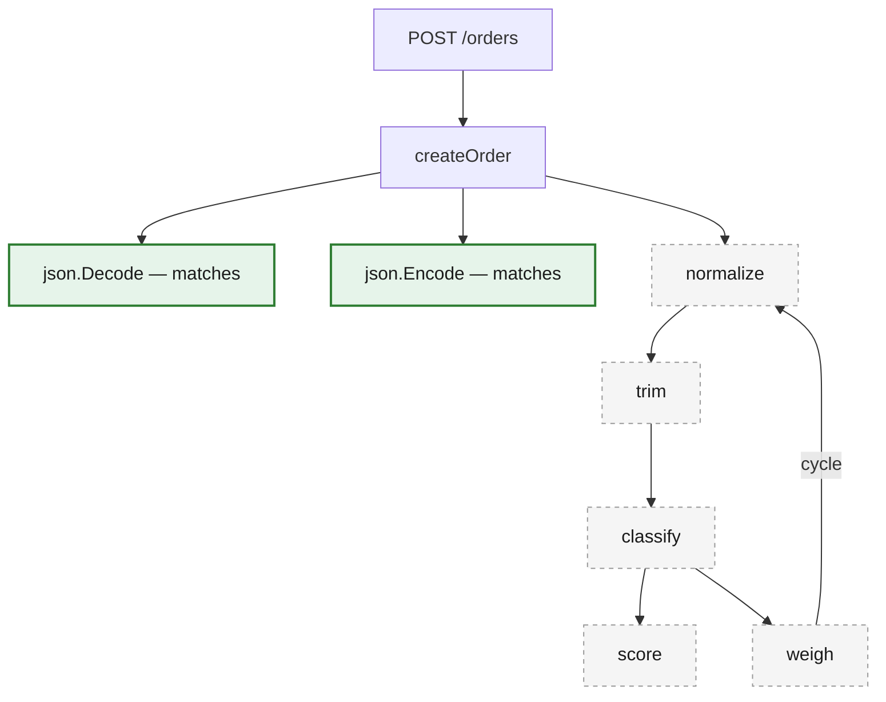
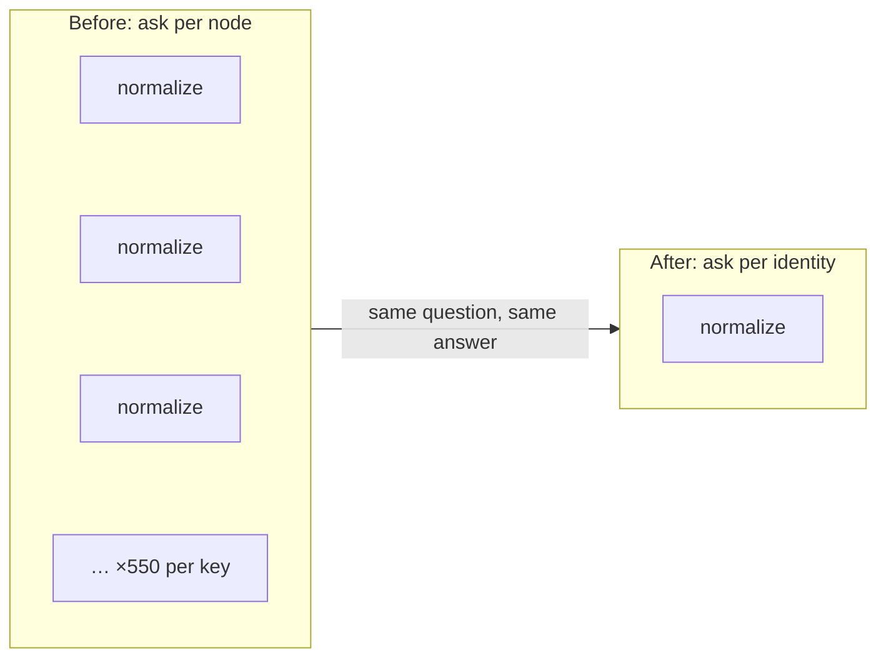
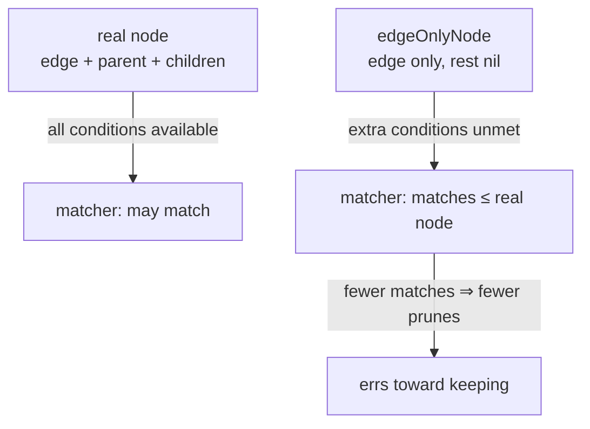
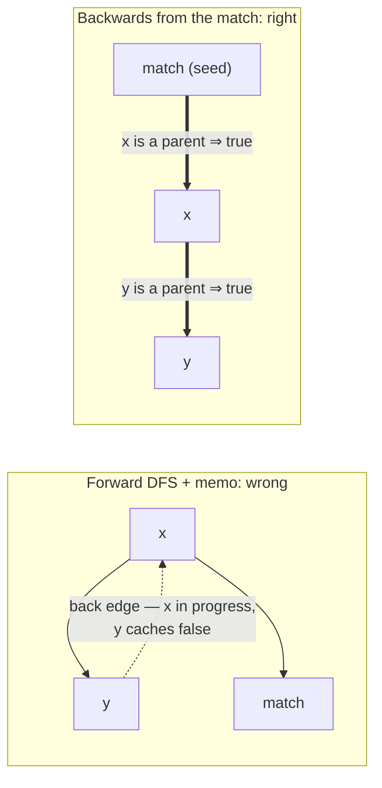

## Why a spec generator walks your code

[apispec](https://github.com/ehabterra/apispec) reads Go source and writes an OpenAPI spec from it. The usual alternative is annotation comments above every handler, and those drift: someone edits the handler, forgets the comment, and the documentation is now politely lying. Generating from the code itself is the whole point.

But the code doesn't hand you a spec. A route registration says "POST /orders goes to createOrder" and stops there — what the endpoint actually accepts and returns lives in the handler's body, often several calls deep, behind a binding helper here and a response wrapper there. The only way to find it is to follow the calls. That's the walk this post is about.

On a small service the walk is instant. On a big module it got slow — and slow wasn't the bad part. The walk has budgets, because it has to: dense call graphs expand forever without them. When a run hits one, it stops early and the spec quietly documents less than the truth. No error. Just an API document that's missing things.

So this is a story about making the walk cheap enough that the budgets stop biting. It ends somewhere I didn't expect: on one project the optimised build produced a *bigger* spec.

## The number that embarrassed me

Internally, the walk starts at each route registration and expands the call graph down to the real handler into what the code calls a "tracker tree". An extraction pass then walks that tree asking a set of *matchers* — one family each for routes, mounts, security, request bodies, responses and parameters — which nodes contribute to the spec.

The tree materialises one node per *path*. If a helper is reachable along ten thousand distinct paths, it gets built ten thousand times. I knew that was wasteful in principle. I didn't know how wasteful until I counted:

```
distinct callee keys                       =    12,882
nodes materialised                         = 7,147,505
nodes visited by the extraction walk       = 7,103,742
nodes whose ENTIRE subtree matched nothing = 6,930,424   (97.6%)
nodes that ever matched                    =   104,156    (1.5%)
```

That's a 163-route service. The tool built 7.1 million nodes to consult 104 thousand of them. Everything else was string utilities, validation helpers, logging — a dense tangle of code that can't possibly say anything about an API, rebuilt once per path, visited, and discarded.



The dashed part is where the millions live. On a real project it isn't five helpers, it's most of the codebase, and the per-path unfolding multiplies it by every path that reaches it.

## The idea, and the catch

The idea is old and obvious: before descending into a subtree, ask "can anything down there possibly be interesting?" If no, don't build it.

The catch is the word *possibly*. The answer has to be **provably no**, not probably no. This is issue [#318](https://github.com/ehabterra/apispec/issues/318), and I sat on it for a while, because a wrong "no" in a tool like this doesn't crash anything. I'll come back to that.

## The property that made it sound

Here's the thing that made pruning legitimate rather than a gamble. Every matcher family's `MatchNode` is a **pure function of the call edge** — the callee's name, receiver and package, the caller's name. The extractor already documents this and leans on it for its per-edge matcher memos. Only the *extraction* step, which runs after a match, cares about a node's ancestry.

So "does this subtree contain anything a matcher would accept" is a property of **content identity**, not of path. `normalize` matches nothing whether you reached it through `createOrder` or `listOrders` or forty layers of middleware.

And that's exactly what a per-path unfolding can't exploit on its own. It was re-asking the same question millions of times about the same handful of distinct identities. The fix is to compute the answer once over the *plan graph* — the ~12,900 content identities — instead of over the unfolded tree of 7.1 million nodes.



Three orders of magnitude fewer questions, before you've saved a single node.

## The fear

Let me be honest about why I nearly didn't ship this. The failure mode of a bad prune here is not a crash or a wrong number in a log. It's a **silently smaller spec**.

Skip one subtree that would have contributed, and a route, a request body, or a response quietly disappears from someone's API documentation. Nobody gets an error. The spec just says less than the truth, and it looks completely fine. For a tool whose whole job is telling the truth about an API, that's worse than being slow. Slow is visible. Wrong is not.

Three things answered the fear.

**Keep anything that can reach a match.** The predicate isn't "does this node match" — it's "can this node's subtree *reach* a match". A barren ancestor of a matching node is still built. Which means the extraction step that walks **up** from a matching node to resolve provenance is unaffected: nothing a kept node can reach is ever pruned. If your first reaction to pruning is "but I need the parents later" — that's the answer. The parents of anything that matters are, by construction, things that matter.

**Over-approximate on purpose.** To evaluate a matcher for an edge before any node exists, the code hands it a stand-in — `edgeOnlyNode` — that carries the edge and answers everything else as an unparented, childless node.

```go
type edgeOnlyNode struct{ edge *metadata.CallGraphEdge }

func (n edgeOnlyNode) GetParent() TrackerNodeInterface     { return nil }
func (n edgeOnlyNode) GetChildren() []TrackerNodeInterface { return nil }
func (n edgeOnlyNode) GetEdge() *metadata.CallGraphEdge    { return n.edge }
```

Today every `MatchNode` reads only `GetEdge()`. But suppose someone later writes a matcher that *does* consult ancestry. Through the stand-in it would see "no ancestry", and since every such check is a further condition to satisfy, it can only match **fewer** things than the real node would — never more. Fewer matches through the stand-in means fewer prunes, not more. The error falls toward keeping.



**Represent every family, or else.** The base predicate, `edgeMatchesAnyFamily`, ORs across all six matcher families. Every family the extraction walk consults *has* to be in that list. Leave one out and the prune drops subtrees that family would have matched — routes going quietly missing, the exact failure this whole design guards against. The code comment says so in capitals, because that's the maintenance hazard: the soundness argument has a roll call, and a future seventh family has to show up to it.

## The cycle trap

There's one genuinely instructive trap in the reachability computation itself, and it's the part I'd want someone to steal.

The obvious implementation is a forward DFS with memoisation: "can `x` reach a match? Ask its children, cache the answer." Over a DAG, fine. Over a call graph — which has cycles everywhere — it's wrong in a quiet way.

Take `x → y`, `y → x` (a back edge), and `x → match`. The DFS enters `x`, recurses into `y`, and `y` asks about `x` — which is still *in progress*, so the cycle guard says no. `y` caches `false`. But `y → x → match` is a perfectly good path. The memo is poisoned, and fixing it forwards needs SCC condensation or repeated passes.

Run the fixpoint **backwards** instead. While enumerating identities forwards, record *reverse* edges. Seed the reachable-set with the identities whose own edge matches. Then propagate: any parent of a reachable identity is reachable, until nothing changes. Reachability is a least fixpoint over an OR, and propagating from the goals reaches exactly the identities with a path to one. Cycles simply stop being a case.



Both passes are linear. There's a unit test pinning exactly the `x → y → x` shape, because this is the kind of bug that passes every acyclic test you write.

## What it bought

Mapping-stage times, minima of three interleaved pairs:

```
163-route service   6.06s -> 2.67s    nodes 7,147,505 -> 405,490  (-94.3%)
                                      peak RSS 1145MB -> 522MB    (-54%)
the apispec repo    6.58s -> 0.58s
```

On the 163-route service the output is **byte-identical**, and deterministic across runs. That diff — empty — is the real proof, not the benchmark.

## The part I didn't expect

On the apispec repo itself the output *changed*. My stomach dropped when I saw the diff. Then I read it: it had only **gained**.

apispec has budgets — a per-route node cap, an instance cap on repeated call copies — because without them, dense graphs expand forever. The un-pruned baseline was exhausting its per-route budget on 6 of 36 routes and dropping 8,706,027 call copies at the instance cap. Response bodies were silently missing from those routes, and had been for as long as anyone had run the tool on this repo.

Pruning stopped spending the budget on barren subtrees, so it reached the parts that mattered. The bodies came back. The instance cap went from dropping 3,624,817 copies to 509,218.

And I could confirm the pruned output is actually *converged*, not just differently truncated: raise both caps 20× on the pruned build and nothing changes. The same raise on the baseline didn't terminate in ten minutes.

That's the second-order effect worth remembering. When a system truncates under a budget, removing waste doesn't just save time — it converts directly into more output. "Faster *and* better" usually smells like marketing. Under a budget, it's just arithmetic.

## Wiring it in without breaking anyone

The predicate belongs to the extractor, since the matcher families are its own; it installs the memoised edge predicate into the tree at setup. A nil predicate is the off switch and the default — `canReachMatch` answers `true` unconditionally without one. So a consumer that wants the full unfolding simply never installs one; the diagram server, which builds its own eager tree and never runs the extractor, doesn't know the prune exists.

The regression guard is a fixture, `testdata/barren_subtree` ([PR #348](https://github.com/ehabterra/apispec/pull/348)): two routes wrapped around a deliberately dense, mutually recursive utility layer that matches nothing. The test asserts the paths, the request body, the status-coded response and the array response all survive. Its output is identical with and without pruning — so it's a **change detector**, not a test of the speedup. If a future edit to the predicate ever eats a route, that test flips, loudly.

## If your traversal is too slow

What I'd actually generalise from this, in the order I'd do it:

- **Count consulted vs. visited before touching anything.** I guessed "a lot of waste"; the instrument said 97.6% barren against 1.5% useful. That ratio is what justified the effort — and told me to attack the *walk*, not the per-node cost.
- **Find the invariant that makes the answer path-independent.** Here it was "matchers are pure in the edge". That's the step that turns millions of questions into thousands, and it's the real work — the rest is a worklist loop.
- **Prune on "can this *reach* anything useful", never "does this *look* useful".** Reachability is provable; looking useful is a heuristic, and heuristics in a prune are silent data loss on a delay.
- **Over-approximate deliberately, and know which way your error falls.** Design the stand-in so that any information it withholds can only cause *keeping*, never *dropping*.
- **Keep what later stages walk up into.** Provenance resolution climbs from matches toward the root; "can reach a match" keeps every such ancestor for free.
- **Run the fixpoint backwards from the goal when the graph has cycles.** Forward memoised DFS caches premature negatives through back edges.
- **Enumerate every consumer of the walk.** Every matcher family in the predicate, every caller of the tree accounted for (or opted out via the nil default). A forgotten one is a hole nobody sees.
- **Prove it with a byte-identical diff on real output**, plus a fixture that fails loud. A benchmark tells you it's fast; only the diff tells you it's *right*.
- **Look for the budget dividend.** If anything downstream truncates, saved work is found output.

One honesty clause to end on: none of this transfers as a recipe. The prune was sound because of a property specific to this system — matchers pure in the edge — and without it the whole thing is just a fast way to lose data. Finding your system's version of that property is the job. The loop that exploits it is an afternoon.

---

*The implementation lives in `internal/spec/prune.go` [in the repo](https://github.com/ehabterra/apispec), with the soundness argument written into the doc comments — issue #318, PR #348.*
