<!-- Google tag (gtag.js) -->
<script async src="https://www.googletagmanager.com/gtag/js?id=G-RXWM6BBFPQ"></script>
<script>
  window.dataLayer = window.dataLayer || [];
  function gtag(){dataLayer.push(arguments);}
  gtag('js', new Date());

  gtag('config', 'G-RXWM6BBFPQ');
</script>
# 🔥 Why Audit Logging Doesn't Belong in Your Main Database

**Let's fix a common anti-pattern:** Storing audit logs in your production database. It *seems* easy—until it tanks performance and bloats storage.

I learned this lesson the hard way. A colleague once insisted on implementing audit logs directly in our main DB, dismissing my concerns. Days later, it was done. I warned him of the impending database doom. Months passed, and then the inevitable: a frantic message about our database ballooning by a staggering 600MB per minute, causing critical issues that demanded immediate action.

## 🚨 The Hidden Costs


### Real-world impact:

- 40% slower writes during peak

- 3x storage growth in 6 months

- Compliance reports timing out

### **The Solution: Structured Logging & Decoupled Architecture ✨**

The path to a robust, scalable, and cost-effective audit logging strategy involves two key pillars:

1. Structured Logging:
   Move beyond plain text! Format your logs as machine-readable key-value pairs, ideally JSON. This transforms logs into actionable data, enabling:
    * **Enhanced Searchability & Filtering:** Quickly find specific events by user_id, event_type, error_code, etc.
    * **Automated Analysis:** Seamless integration with log management and SIEM tools.
    * **Improved Debugging:** Rich context helps pinpoint root causes faster.
    * **Consistency & Scalability:** Standardized formats across distributed systems.

    **Best Practice:** Always use UTC and ISO 8601 for timestamps (e.g., 2025-01-08T14:30:00Z). **Never log sensitive data** like passwords or PII.
    
    ```go
    // Go: JSON-structured log example
    type AuditEvent struct {
        Timestamp string `json:"timestamp"` // ISO 8601 UTC
        UserID    string `json:"user_id"` 
        Action    string `json:"action"`   // "login", "delete"
        Entity    string `json:"entity"`   // "order", "user"
    }
    ```
    
    **Why?**
    - Enables filtering by `user_id`, `action`, etc.
      - Integrates seamlessly with Security Information and Event Management (SIEM) tools

2. Decoupled Cloud Storage & Reporting:  
   Offload audit logs to purpose-built cloud services. This ensures your main application database remains performant and allows for specialized tools for analysis and reporting.  
   **Cloud Alternatives for Audit Logs:**
    * **Google Cloud Platform (GCP):**
        * **Cloud Logging:** Fully managed service for log storage, search, analysis, monitoring, and alerting. Use Log Buckets for storage and Logs Explorer/Analytics for querying.
        * **BigQuery:** For complex analytical SQL queries on large log datasets.
        * **Cloud Storage:** Cost-effective for long-term archival.
    * **Amazon Web Services (AWS):**
        * **CloudTrail:** Records AWS API calls for governance and compliance.
        * **CloudWatch Logs:** Centralizes logs from applications and AWS services for real-time monitoring.
        * **Amazon S3:** Highly scalable object storage for long-term archival.
        * **Amazon OpenSearch Service:** For powerful log analysis and visualization (part of the ELK stack).

### **Empowering Business Admins: Reporting & Querying 📊**

Audit logs aren't just for tech teams; they're a goldmine for business intelligence! Build a separate reporting layer, ideally a data warehouse or data mart, optimized for analytical queries. This empowers back-office teams with:

* **Intuitive Search & Query:** Easy access to specific user actions, transactions, or compliance data.
* **Data Visualization:** Dashboards, charts, and trendlines for quick insights.
* **Automated Alerting:** Proactive notifications for security violations or business rule breaches.
* **Compliance Verification:** Streamlined generation of audit trails for regulatory needs.

**Tools:** Generic log management platforms like the **ELK Stack (Elasticsearch, Logstash, Kibana)**, cloud-native services (GCP Cloud Logging Analytics, AWS CloudWatch Logs), and specialized audit management software such as ComplianceQuest, AuditBoard, etc.

### **GCP Cloud Logging with GoLang Example 🚀**

Here's how you can create and query structured audit logs using Go with GCP Cloud Logging:
#### Log to Cloud Logging:
```go
func logAudit(event AuditEvent) error {
    entry := logging.Entry{
        Payload:   event,
        Severity: logging.Info,
    }
	
    return logger.Log(entry) // Async by default
}
```
#### Query in BigQuery:
```sql
-- Daily active users report
SELECT
  COUNT(DISTINCT user_id) AS active_users,
  DATE(timestamp) AS day
FROM `project.audit.logs`
GROUP BY day
```

### **Our Awesome Audit Trail Blueprint! 🏗️**

```mermaid
graph TD
    A[Your App/Service ✍️] -- Sends neatly packed logs (Structured Logs!) --> B(Log Central: Cloud Logging ☁️ / CloudWatch Logs 🦉 / Fluentd 🚀)
B -- Routes those log packages 📬 --> C{Log Vault: Cloud Buckets 📦 / S3 🗄️ / Elasticsearch 🔍}
C -- For serious analysis & long-term storage 💾 --> D[Data Brain: Data Warehouse 🧠 / BigQuery 📊 / OpenSearch 🔭 / ClickHouse ⚡]
D -- Turns data into cool pictures & insights 📈 --> E[Insight Hub: BI Tools 💡 / Custom Dashboards 🖼️ / Kibana ✨ / Grafana 📊]
E -- Delivers the juicy details & alerts 🚨 --> F[Biz Admins 💼 / Security Squad 🛡️]
A -- Keeps doing its main job 🏃‍♂️ --> G[Main App DB 💾]
G -. "No Log Spam Here!" 🚫 .-> B
```



**In short:** We're giving your audit logs their own awesome pipeline so they can be super useful without making your main app slow and grumpy! 😎

### 🧩 Key Takeaways
1. **Never log to production DB –** it's for transactions, not analytics.
1. **Structure your logs –** JSON/Protobuf > plain text.
1. **Use cloud-native tools –** GCP/AWS handle scaling and retention.

**👉 Ready to level up your logging game?** Let me know your thoughts or share how you manage audit logs in your projects!

#AuditLogging #StructuredLogging #CloudComputing #GCP #AWS #GoLang #BackendEngineering #DevOps #Security #Compliance #DataArchitecture

#### **Resources**

1. Audit Logging: What It Is & How It Works , Datadog, [https://www.datadoghq.com/knowledge-center/audit-logging/](https://www.datadoghq.com/knowledge-center/audit-logging/)
2. Audit Trail - OutSystems 11 Documentation, [https://success.outsystems.com/documentation/11/app_architecture/audit_trail/](https://success.outsystems.com/documentation/11/app_architecture/audit_trail/)
3. Real-Time and Periodic Database Auditing: What Is Better? - DataSunrise, [https://www.datasunrise.com/knowledge-center/real-time-vs-periodic-database-auditing/](https://www.datasunrise.com/knowledge-center/real-time-vs-periodic-database-auditing/)
4. Introducing SQL Audit Logs for Fabric Data Warehouse - Microsoft Fabric Blog, [https://blog.fabric.microsoft.com/en-US/blog/introducing-sql-audit-logs-for-fabric-datawarehouse/](https://blog.fabric.microsoft.com/en-US/blog/introducing-sql-audit-logs-for-fabric-datawarehouse/)
5. Best BI / Monitoring / Logging Tools - Plutora.com, [https://www.plutora.com/ci-cd-tools-categories/bi-monitoring-logging](https://www.plutora.com/ci-cd-tools-categories/bi-monitoring-logging)
6. Pattern: Audit logging - Microservices.io, [https://microservices.io/patterns/observability/audit-logging.html](https://microservices.io/patterns/observability/audit-logging.html)
7. Monitoring and Reducing Database I/O Contention - BizTalk Server , Microsoft Learn, [https://learn.microsoft.com/en-us/biztalk/technical-guides/monitoring-and-reducing-database-i-o-contention](https://learn.microsoft.com/en-us/biztalk/technical-guides/monitoring-and-reducing-database-i-o-contention)
8. Monitoring and Reducing DTC Log File Disk I/O Contention - BizTalk Server, [https://learn.microsoft.com/en-us/biztalk/technical-guides/monitoring-and-reducing-dtc-log-file-disk-i-o-contention](https://learn.microsoft.com/en-us/biztalk/technical-guides/monitoring-and-reducing-dtc-log-file-disk-i-o-contention)
9. How does throughput impact database performance? - Milvus, [https://milvus.io/ai-quick-reference/how-does-throughput-impact-database-performance](https://milvus.io/ai-quick-reference/how-does-throughput-impact-database-performance)
10. Database Performance: Impact of Storage Limitations - Simplyblock, [https://www.simplyblock.io/blog/database-performance-storage-limitations/](https://www.simplyblock.io/blog/database-performance-storage-limitations/)
11. What Is Structured Logging and Why You Should Use It - Sematext, [https://sematext.com/glossary/structured-logging/](https://sematext.com/glossary/structured-logging/)
12. The Power of Structured Logging: Why It Matters in Modern Development - Atatus, [https://www.atatus.com/blog/structured-logging-guide/](https://www.atatus.com/blog/structured-logging-guide/)
13. 5 Elk Stack Pros and Cons - ChaosSearch, [https://www.chaossearch.io/blog/elk-stack-pros-and-cons](https://www.chaossearch.io/blog/elk-stack-pros-and-cons)
14. Centralized Logging Systems – System Design , GeeksforGeeks, [https://www.geeksforgeeks.org/centralized-logging-systems-system-design/](https://www.geeksforgeeks.org/centralized-logging-systems-system-design/)
15. What Is Structured Logging and How to Use It - Loggly, [https://www.loggly.com/use-cases/what-is-structured-logging-and-how-to-use-it/](https://www.loggly.com/use-cases/what-is-structured-logging-and-how-to-use-it/)
16. Structured Logging Best Practices: Implementation Guide with Examples - Uptrace, [https://uptrace.dev/glossary/structured-logging](https://uptrace.dev/glossary/structured-logging)
17. Best 10 Audit Tools of 2025 - ComplianceQuest, [https://www.compliancequest.com/audit-tools/](https://www.compliancequest.com/audit-tools/)
18. 6 Common Log File Formats , CrowdStrike, [https://www.crowdstrike.com/en-us/cybersecurity-101/next-gen-siem/log-file-formats/](https://www.crowdstrike.com/en-us/cybersecurity-101/next-gen-siem/log-file-formats/)
19. logging package - cloud.google.com/go/logging - Go Packages, [https://pkg.go.dev/cloud.google.com/go/logging](https://pkg.go.dev/cloud.google.com/go/logging)
20. Setting Up Cloud Logging for Go - Google Cloud, [https://cloud.google.com/logging/docs/setup/go](https://cloud.google.com/logging/docs/setup/go)
21. Logging to stderr and stdout golang Google Cloud Platform - Stack Overflow, [https://stackoverflow.com/questions/57888588/logging-to-stderr-and-stdout-golang-google-cloud-platform](https://stackoverflow.com/questions/57888588/logging-to-stderr-and-stdout-golang-google-cloud-platform)
22. Logging client libraries , Google Cloud, [https://cloud.google.com/logging/docs/reference/libraries](https://cloud.google.com/logging/docs/reference/libraries)
23. Cloud Logging documentation - Google Cloud, [https://cloud.google.com/logging/docs](https://cloud.google.com/logging/docs)
24. Cloud Logging overview , Google Cloud, [https://cloud.google.com/logging/docs/overview](https://cloud.google.com/logging/docs/overview)
25. Audit logging , Cloud Search - Google for Developers, [https://developers.google.com/workspace/cloud-search/docs/guides/audit-logging-manual](https://developers.google.com/workspace/cloud-search/docs/guides/audit-logging-manual)
26. Cloud Audit Logs overview - Google Cloud, [https://cloud.google.com/logging/docs/audit](https://cloud.google.com/logging/docs/audit)
27. Import logs from Cloud Storage to Cloud Logging , Cloud Architecture Center , Google Cloud, [https://cloud.google.com/architecture/import-logs-from-storage-to-logging](https://cloud.google.com/architecture/import-logs-from-storage-to-logging)
28. AWS services for logging and monitoring - AWS Prescriptive Guidance - AWS Documentation, [https://docs.aws.amazon.com/prescriptive-guidance/latest/logging-monitoring-for-application-owners/aws-services-logging-monitoring.html](https://docs.aws.amazon.com/prescriptive-guidance/latest/logging-monitoring-for-application-owners/aws-services-logging-monitoring.html)
29. Logging and monitoring in AWS Audit Manager, [https://docs.aws.amazon.com/audit-manager/latest/userguide/security-logging-and-monitoring.html](https://docs.aws.amazon.com/audit-manager/latest/userguide/security-logging-and-monitoring.html)
30. Architecture overview - Centralized Logging with OpenSearch - AWS Documentation, [https://docs.aws.amazon.com/solutions/latest/centralized-logging-with-opensearch/architecture-overview.html](https://docs.aws.amazon.com/solutions/latest/centralized-logging-with-opensearch/architecture-overview.html)
31. Document and centralize architecture diagrams - AWS Security Incident Response User Guide, [https://docs.aws.amazon.com/security-ir/latest/userguide/document-and-centralize-architecture-diagrams.html](https://docs.aws.amazon.com/security-ir/latest/userguide/document-and-centralize-architecture-diagrams.html)
32. List log entries - Google Cloud, [https://cloud.google.com/logging/docs/samples/logging-list-log-entries](https://cloud.google.com/logging/docs/samples/logging-list-log-entries)
